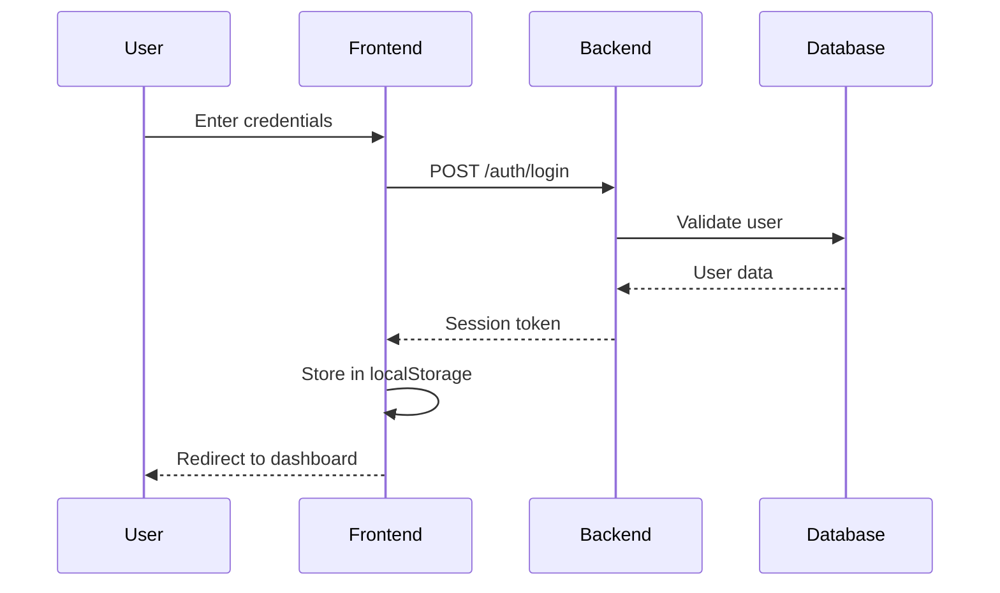

# 🏗️ AuctionFlow - Comprehensive Technical Documentation

## 📋 Table of Contents

1. [System Overview](#system-overview)
2. [Architecture](#architecture)
3. [Technology Stack](#technology-stack)
4. [Backend Documentation](#backend-documentation)
5. [Frontend Documentation](#frontend-documentation)
6. [Database Schema](#database-schema)
7. [API Documentation](#api-documentation)
8. [Authentication & Authorization](#authentication--authorization)
9. [Deployment & Infrastructure](#deployment--infrastructure)
10. [Development Workflow](#development-workflow)
11. [Security Considerations](#security-considerations)
12. [Performance & Monitoring](#performance--monitoring)
13. [Troubleshooting](#troubleshooting)
14. [Future Roadmap](#future-roadmap)

---

## 🎯 System Overview

**AuctionFlow** is a comprehensive auction workflow management system designed to streamline the process of researching, photographing, and cataloging auction items. The system integrates with external auction platforms (primarily HiBid) and provides role-based access for different team members.

### Core Features

- **Multi-Role Workflow Management**: Admin, Researcher, Photographer, and Researcher2 roles
- **Auction Data Processing**: Automated extraction and processing of auction item data
- **Image Management**: Upload, storage, and organization of item photographs
- **AI Integration**: Automated item description and estimation via n8n workflows
- **Real-time Webhooks**: Integration with external services for data processing
- **Responsive Web Interface**: Modern UI built with Next.js and Tailwind CSS

### Business Logic

The system follows a structured workflow:
1. **Research Phase**: Items are researched and estimated by researchers
2. **Photography Phase**: Items are photographed and documented
3. **Research2 Phase**: Final research and validation
4. **Finalization**: Items are prepared for listing

---

## 🏛️ Architecture

### High-Level Architecture

```
┌─────────────────┐    ┌─────────────────┐    ┌─────────────────┐
│   Frontend      │    │    Backend      │    │   Database      │
│   (Next.js)     │◄──►│   (Django)      │◄──►│  (PostgreSQL)   │
│   Port: 3000    │    │   Port: 8000    │    │   Port: 5432    │
└─────────────────┘    └─────────────────┘    └─────────────────┘
         │                       │                       │
         │                       │                       │
         ▼                       ▼                       ▼
┌─────────────────┐    ┌─────────────────┐    ┌─────────────────┐
│   Nginx         │    │   Redis Cache   │    │   File Storage  │
│   (Reverse      │    │   Port: 6379    │    │   (Uploads)     │
│    Proxy)       │    │                 │    │                 │
└─────────────────┘    └─────────────────┘    └─────────────────┘
```

### Component Architecture

#### Frontend (Next.js)
- **App Router**: Uses Next.js 13+ App Router for modern routing
- **Component Library**: Shadcn/ui components with Tailwind CSS
- **State Management**: React Context for authentication and local state
- **API Integration**: Custom API routes and external service calls

#### Backend (Django)
- **REST API**: Django REST Framework for API endpoints
- **Models**: Django ORM for database operations
- **Webhooks**: Integration with n8n for external data processing
- **Authentication**: Session-based authentication

#### Database Layer
- **Primary**: PostgreSQL for production data
- **Secondary**: SQLite for development and local storage
- **Caching**: Redis for session management and performance

---

## 🛠️ Technology Stack

### Frontend Technologies

| Technology | Version | Purpose |
|------------|---------|---------|
| Next.js | 13.5.1 | React framework with SSR/SSG |
| React | 18.2.0 | UI library |
| TypeScript | 5.2.2 | Type safety |
| Tailwind CSS | 3.3.3 | Utility-first CSS framework |
| Shadcn/ui | Latest | Component library |
| Lucide React | 0.446.0 | Icon library |
| React Hook Form | 7.53.0 | Form management |
| Zod | 3.23.8 | Schema validation |

### Backend Technologies

| Technology | Version | Purpose |
|------------|---------|---------|
| Django | 5.2.4 | Web framework |
| Django REST Framework | 3.14.0 | API framework |
| PostgreSQL | 15 | Primary database |
| Redis | 7 | Caching and sessions |
| Gunicorn | 21.2.0 | WSGI server |
| psycopg2-binary | 2.9.9 | PostgreSQL adapter |

### Infrastructure & DevOps

| Technology | Purpose |
|------------|---------|
| Docker | Containerization |
| Docker Compose | Multi-container orchestration |
| Nginx | Reverse proxy and static file serving |
| Ubuntu | Production server OS |
| SSL/TLS | HTTPS encryption |

---

## 🔧 Backend Documentation

### Django Project Structure

```
backend/
├── api/                    # Main API application
│   ├── models.py          # Database models
│   ├── views.py           # API view functions
│   ├── urls.py            # URL routing
│   └── migrations/        # Database migrations
├── backend/               # Django project settings
│   ├── settings.py        # Development settings
│   ├── settings_prod.py   # Production settings
│   ├── urls.py            # Main URL configuration
│   ├── wsgi.py            # WSGI configuration
│   └── asgi.py            # ASGI configuration
├── manage.py              # Django management script
├── requirements.txt       # Python dependencies
├── Dockerfile             # Development container
├── Dockerfile.prod        # Production container
└── db.sqlite3            # SQLite database (dev)
```

### Core Models

#### WebhookData Model
```python
class WebhookData(models.Model):
    sku = models.CharField(max_length=100, unique=True, db_index=True)
    ebay_title = models.TextField(blank=True)
    ebay_description = models.TextField(blank=True)
    condition = models.CharField(max_length=100, blank=True)
    ai_improved_estimate = models.TextField(blank=True)
    ai_improved_description = models.TextField(blank=True)
    quantity = models.IntegerField(default=1)
    raw_data = models.JSONField(default=dict)
    received_at = models.DateTimeField(auto_now_add=True)
    processed = models.BooleanField(default=False)
```

#### HiBidItem Model
```python
class HiBidItem(models.Model):
    url_main = models.URLField(max_length=500, unique=True, db_index=True)
    item_title = models.CharField(max_length=200, blank=True)
    lot_number = models.CharField(max_length=50, blank=True)
    description = models.TextField(blank=True)
    category = models.CharField(max_length=100, blank=True)
    estimate = models.CharField(max_length=100, blank=True)
    auction_name = models.CharField(max_length=200, blank=True)
    all_unique_image_urls = models.JSONField(default=list, blank=True)
    main_image_url = models.URLField(max_length=500, blank=True)
    ai_response = models.TextField(blank=True)
    status = models.CharField(max_length=20, choices=[
        ('pending', 'Pending'),
        ('processed', 'Processed'),
        ('error', 'Error')
    ], default='pending')
```

#### AuctionItem Model
```python
class AuctionItem(models.Model):
    sku = models.CharField(max_length=100, unique=True, db_index=True)
    auction_name = models.CharField(max_length=200)
    item_name = models.CharField(max_length=200)
    lot_number = models.CharField(max_length=50)
    description = models.TextField(blank=True)
    category = models.CharField(max_length=100, blank=True)
    auction_site_estimate = models.CharField(max_length=100, blank=True)
    ai_estimate = models.CharField(max_length=100, blank=True)
    researcher_estimate = models.CharField(max_length=100, blank=True)
    photographer_quantity = models.IntegerField(default=1)
    photographer_images = models.JSONField(default=list)
    status = models.CharField(max_length=20, choices=[
        ('research', 'Research'),
        ('waiting', 'Waiting'),
        ('winning', 'Winning'),
        ('photography', 'Photography'),
        ('research2', 'Research 2'),
        ('finalized', 'Finalized')
    ], default='research')
```

### API Endpoints

#### Core Endpoints

| Method | Endpoint | Description |
|--------|----------|-------------|
| GET | `/api/hello/` | Health check endpoint |
| POST | `/api/test-post/` | Test POST endpoint |
| POST | `/api/call-webhook/` | Trigger n8n webhook processing |
| POST | `/api/receive-webhook-data/` | Receive processed data from n8n |
| POST | `/api/submit-photography/` | Submit photography data |
| GET | `/api/get-webhook-data/` | Retrieve webhook data by SKU |
| GET | `/api/get-hibid-items/` | Get all processed HiBid items |

#### Webhook Integration

The system integrates with n8n workflows for external data processing:

1. **HiBid URL Processing**: 
   - Webhook URL: `https://sorcer.app.n8n.cloud/webhook/789023dc-a9bf-459c-8789-d9d0c993d1cb`
   - Processes HiBid auction URLs and extracts item data

2. **Photography Submission**:
   - Webhook URL: `https://sorcer.app.n8n.cloud/webhook/0be48928-c40c-4e16-a9f1-1e2fdf9ed9d2`
   - Processes photography data and generates SKUs

### Settings Configuration

#### Development Settings (`settings.py`)
```python
DEBUG = True
ALLOWED_HOSTS = ['localhost', '127.0.0.1']
DATABASES = {
    'default': {
        'ENGINE': 'django.db.backends.sqlite3',
        'NAME': BASE_DIR / 'db.sqlite3',
    }
}
```

#### Production Settings (`settings_prod.py`)
```python
DEBUG = False
ALLOWED_HOSTS = os.environ.get('ALLOWED_HOSTS', '').split(',')
DATABASES = {
    'default': {
        'ENGINE': 'django.db.backends.postgresql',
        'NAME': os.environ.get('POSTGRES_DB'),
        'USER': os.environ.get('POSTGRES_USER'),
        'PASSWORD': os.environ.get('POSTGRES_PASSWORD'),
        'HOST': os.environ.get('POSTGRES_HOST', 'localhost'),
        'PORT': os.environ.get('POSTGRES_PORT', '5432'),
    }
}
```

---

## 🎨 Frontend Documentation

### Next.js Project Structure

```
project/
├── app/                    # App Router directory
│   ├── admin/             # Admin dashboard
│   ├── auth/              # Authentication pages
│   ├── photographer/      # Photographer dashboard
│   ├── researcher/        # Researcher dashboard
│   ├── researcher2/       # Researcher2 dashboard
│   ├── layout.tsx         # Root layout
│   └── page.tsx           # Home page
├── components/            # Reusable components
│   ├── ui/                # Shadcn/ui components
│   ├── layout/            # Layout components
│   └── ImageUpload.tsx    # Custom image upload
├── contexts/              # React contexts
│   └── AuthContext.tsx    # Authentication context
├── hooks/                 # Custom React hooks
├── lib/                   # Utility libraries
├── pages/                 # API routes
│   └── api/               # Next.js API routes
├── services/              # Service layer
│   ├── database.ts        # PostgreSQL service
│   ├── dataStore.ts       # Data management
│   └── sqliteService.ts   # SQLite service
├── types/                 # TypeScript type definitions
└── public/                # Static assets
```

### Key Components

#### Authentication Context
```typescript
interface AuthContextType {
  user: User | null;
  login: (email: string, password: string) => Promise<boolean>;
  logout: () => void;
  isLoading: boolean;
}

interface User {
  id: string;
  name: string;
  email: string;
  role: 'admin' | 'researcher' | 'photographer' | 'researcher2';
}
```

#### Data Types
```typescript
export interface AuctionItem {
  id: string;
  url?: string;
  auctionName?: string;
  lotNumber?: string;
  itemName?: string;
  category?: string;
  description?: string;
  status: 'research' | 'winning' | 'photography' | 'research2' | 'finalized';
  researcherEstimate?: string;
  photographerQuantity?: number;
  photographerImages?: string[];
  createdAt: Date;
  updatedAt: Date;
}

export interface UserAccount {
  id: string;
  name: string;
  email: string;
  role: 'researcher' | 'photographer' | 'researcher2' | 'admin';
  isActive: boolean;
}
```

### Page Components

#### Admin Dashboard (`/admin`)
- **Overview**: Complete system overview with all items
- **User Management**: Create, edit, and manage user accounts
- **Webhook Data**: View and manage webhook data
- **HiBid Items**: Monitor processed HiBid items
- **System Stats**: Dashboard statistics and metrics

#### Researcher Dashboard (`/researcher`)
- **Item Research**: Research and estimate auction items
- **Status Management**: Update item status and assignments
- **Reference URLs**: Add supporting research links
- **Bulk Operations**: Handle multiple items simultaneously

#### Photographer Dashboard (`/photographer`)
- **Image Upload**: Upload and manage item photographs
- **Quantity Management**: Set photograph quantities
- **Status Updates**: Move items to next workflow stage
- **Image Gallery**: View and organize uploaded images

#### Researcher2 Dashboard (`/researcher2`)
- **Final Research**: Complete final research phase
- **Data Validation**: Validate and finalize item data
- **Quality Control**: Ensure data accuracy and completeness

### API Routes

#### User Management
```typescript
// GET /api/users - Get all users
// POST /api/users - Create new user
// GET /api/users/[id] - Get user by ID
// PUT /api/users/[id] - Update user
// DELETE /api/users/[id] - Delete user
// GET /api/users/email/[email] - Get user by email
```

#### System Management
```typescript
// GET /api/health - Health check
// GET /api/test-sqlite - Test SQLite connection
// POST /api/system/reset - Reset system data
// POST /api/clear-webhook-data - Clear webhook data
```

#### File Management
```typescript
// POST /api/upload/image - Upload image file
// GET /api/uploads/[...path] - Serve uploaded files
```

#### Webhook Integration
```typescript
// POST /api/webhook/receive - Receive webhook data
// POST /api/webhook/send-external - Send external webhook
// GET /api/webhook/receive/[id] - Get webhook by ID
```

---

## 🗄️ Database Schema

### PostgreSQL Schema

#### Users Table
```sql
CREATE TABLE users (
    id VARCHAR(255) PRIMARY KEY,
    name VARCHAR(255) NOT NULL,
    email VARCHAR(255) UNIQUE NOT NULL,
    password VARCHAR(255) NOT NULL,
    role VARCHAR(50) NOT NULL,
    created_at TIMESTAMP DEFAULT CURRENT_TIMESTAMP,
    updated_at TIMESTAMP DEFAULT CURRENT_TIMESTAMP,
    is_active BOOLEAN DEFAULT true
);
```

#### Auction Items Table
```sql
CREATE TABLE auction_items (
    id VARCHAR(255) PRIMARY KEY,
    url TEXT,
    auction_name VARCHAR(255),
    lot_number VARCHAR(100),
    images TEXT[],
    sku VARCHAR(100),
    item_name VARCHAR(255),
    category VARCHAR(100),
    description TEXT,
    lead TEXT,
    auction_site_estimate VARCHAR(100),
    ai_description TEXT,
    ai_estimate VARCHAR(100),
    status VARCHAR(50) NOT NULL,
    researcher_estimate VARCHAR(100),
    researcher_description TEXT,
    reference_urls TEXT[],
    photographer_quantity INTEGER,
    photographer_images TEXT[],
    final_data JSONB,
    created_at TIMESTAMP DEFAULT CURRENT_TIMESTAMP,
    updated_at TIMESTAMP DEFAULT CURRENT_TIMESTAMP,
    assigned_to VARCHAR(255),
    notes TEXT,
    priority VARCHAR(20),
    tags TEXT[]
);
```

#### Workflow Steps Table
```sql
CREATE TABLE workflow_steps (
    id VARCHAR(255) PRIMARY KEY,
    item_id VARCHAR(255) REFERENCES auction_items(id),
    from_status VARCHAR(50),
    to_status VARCHAR(50),
    user_id VARCHAR(255) REFERENCES users(id),
    user_name VARCHAR(255),
    timestamp TIMESTAMP DEFAULT CURRENT_TIMESTAMP,
    notes TEXT,
    data JSONB
);
```

#### Notifications Table
```sql
CREATE TABLE notifications (
    id VARCHAR(255) PRIMARY KEY,
    user_id VARCHAR(255) REFERENCES users(id),
    type VARCHAR(50),
    title VARCHAR(255),
    message TEXT,
    read BOOLEAN DEFAULT false,
    created_at TIMESTAMP DEFAULT CURRENT_TIMESTAMP,
    item_id VARCHAR(255) REFERENCES auction_items(id)
);
```

### SQLite Schema (Development)

#### Webhook Items Table
```sql
CREATE TABLE webhook_items (
    id TEXT PRIMARY KEY,
    url_main TEXT,
    item_name TEXT,
    lot_number TEXT,
    description TEXT,
    lead TEXT,
    category TEXT,
    estimate TEXT,
    auction_name TEXT,
    all_unique_image_urls TEXT,
    main_image_url TEXT,
    gallery_image_urls TEXT,
    broad_search_images TEXT,
    tumbnail_images TEXT,
    ai_response TEXT,
    received_at TEXT,
    status TEXT,
    created_at DATETIME DEFAULT CURRENT_TIMESTAMP
);
```

---

## 🔌 API Documentation

### Authentication

The system uses session-based authentication with the following flow:

1. **Login**: POST to `/auth/login` with email and password
2. **Session**: User session stored in localStorage and server-side
3. **Authorization**: Role-based access control for different dashboards

### Request/Response Format

All API responses follow this format:
```json
{
  "message": "Success message",
  "data": { /* response data */ },
  "status": "success|error",
  "error": "Error message (if applicable)"
}
```

### Error Handling

Standard HTTP status codes are used:
- `200`: Success
- `201`: Created
- `400`: Bad Request
- `401`: Unauthorized
- `403`: Forbidden
- `404`: Not Found
- `500`: Internal Server Error

### Rate Limiting

Currently no rate limiting is implemented, but it's recommended for production use.

---

## 🔐 Authentication & Authorization

### User Roles

| Role | Permissions | Dashboard Access |
|------|-------------|------------------|
| **Admin** | Full system access | All dashboards + user management |
| **Researcher** | Research items, update estimates | Researcher dashboard only |
| **Photographer** | Upload images, manage photography | Photographer dashboard only |
| **Researcher2** | Final research and validation | Researcher2 dashboard only |

### Authentication Flow



### Security Measures

1. **Password Storage**: Plain text (⚠️ Should be hashed in production)
2. **Session Management**: localStorage + server-side sessions
3. **CORS**: Configured for specific origins
4. **Input Validation**: Basic validation on forms
5. **SQL Injection**: Protected by Django ORM

### Recommended Security Improvements

1. **Password Hashing**: Implement bcrypt or similar
2. **JWT Tokens**: Replace session-based auth with JWT
3. **HTTPS**: Enforce HTTPS in production
4. **Input Sanitization**: Enhanced input validation
5. **Rate Limiting**: Implement API rate limiting
6. **Audit Logging**: Log all user actions

---

## 🚀 Deployment & Infrastructure

### Docker Configuration

#### Development (`docker-compose.yml`)
```yaml
services:
  backend:
    build: ./backend
    ports: ["8000:8000"]
    environment:
      - DEBUG=True
      - DJANGO_SETTINGS_MODULE=backend.settings
    depends_on: [db, redis]

  frontend:
    build: ./project
    ports: ["3000:3000"]
    environment:
      - NEXT_PUBLIC_API_URL=http://localhost:8000/api
    depends_on: [backend]

  db:
    image: postgres:15-alpine
    environment:
      - POSTGRES_DB=auctionflow
      - POSTGRES_USER=auctionuser
      - POSTGRES_PASSWORD=password
    volumes:
      - postgres_data:/var/lib/postgresql/data

  redis:
    image: redis:7-alpine
    ports: ["6379:6379"]
```

#### Production (`docker-compose.prod.yml`)
```yaml
services:
  postgres:
    image: postgres:15-alpine
    environment:
      - POSTGRES_DB=${POSTGRES_DB}
      - POSTGRES_USER=${POSTGRES_USER}
      - POSTGRES_PASSWORD=${POSTGRES_PASSWORD}
    volumes:
      - postgres_data:/var/lib/postgresql/data
    healthcheck:
      test: ["CMD-SHELL", "pg_isready -U ${POSTGRES_USER} -d ${POSTGRES_DB}"]

  frontend:
    build:
      context: ./project
      dockerfile: Dockerfile.prod
    environment:
      - NODE_ENV=production
      - NEXT_PUBLIC_API_URL=${NEXT_PUBLIC_API_URL}
    depends_on:
      postgres:
        condition: service_healthy

  nginx:
    build: ./nginx
    ports: ["80:80", "443:443"]
    volumes:
      - ./nginx/conf.d:/etc/nginx/conf.d
      - ./nginx/ssl:/etc/nginx/ssl
    depends_on: [frontend]
```

### Environment Variables

#### Development (`.env.local`)
```env
# Database Configuration
NEXT_PUBLIC_DB_HOST=localhost
NEXT_PUBLIC_DB_PORT=5432
NEXT_PUBLIC_DB_NAME=auctionflow
NEXT_PUBLIC_DB_USER=auctionuser
NEXT_PUBLIC_DB_PASSWORD=password

# API Configuration
NEXT_PUBLIC_API_URL=http://localhost:3000/api
```

#### Production (`.env.prod`)
```env
# Database Configuration
POSTGRES_DB=auctionflow
POSTGRES_USER=auctionuser
POSTGRES_PASSWORD=secure_password_here
POSTGRES_HOST=postgres
POSTGRES_PORT=5432

# Application Configuration
NEXT_PUBLIC_API_URL=https://yourdomain.com/api
SECRET_KEY=your_secret_key_here
ALLOWED_HOSTS=yourdomain.com,www.yourdomain.com

# CORS Configuration
CORS_ALLOWED_ORIGINS=https://yourdomain.com,https://www.yourdomain.com
```

### Deployment Scripts

#### Quick Deploy (`deploy.sh`)
```bash
#!/bin/bash
echo "🚀 Deploying AuctionFlow Application..."

# Build and start services
docker-compose build
docker-compose up -d

# Wait for services
sleep 30

# Run migrations
docker-compose exec backend python manage.py migrate

# Health checks
curl -f http://localhost:8000/api/hello/
curl -f http://localhost:3000
```

#### Production Deploy (`deploy-prod.sh`)
```bash
#!/bin/bash
# Production deployment with full cleanup
docker-compose -f docker-compose.prod.yml down -v
docker system prune -af
docker-compose -f docker-compose.prod.yml up -d --build
```

### Nginx Configuration

#### Default Configuration (`nginx/conf.d/default.conf`)
```nginx
server {
    listen 80;
    server_name yourdomain.com www.yourdomain.com;

    # Redirect HTTP to HTTPS
    return 301 https://$server_name$request_uri;
}

server {
    listen 443 ssl http2;
    server_name yourdomain.com www.yourdomain.com;

    # SSL Configuration
    ssl_certificate /etc/nginx/ssl/cert.pem;
    ssl_certificate_key /etc/nginx/ssl/key.pem;

    # Frontend
    location / {
        proxy_pass http://frontend:3000;
        proxy_set_header Host $host;
        proxy_set_header X-Real-IP $remote_addr;
        proxy_set_header X-Forwarded-For $proxy_add_x_forwarded_for;
        proxy_set_header X-Forwarded-Proto $scheme;
    }

    # API Routes
    location /api/ {
        proxy_pass http://frontend:3000;
        proxy_set_header Host $host;
        proxy_set_header X-Real-IP $remote_addr;
        proxy_set_header X-Forwarded-For $proxy_add_x_forwarded_for;
        proxy_set_header X-Forwarded-Proto $scheme;
    }

    # Static Files
    location /uploads/ {
        alias /var/www/uploads/;
        expires 1y;
        add_header Cache-Control "public, immutable";
    }
}
```

---

## 💻 Development Workflow

### Local Development Setup

1. **Prerequisites**:
   ```bash
   # Install Docker and Docker Compose
   sudo apt update
   sudo apt install docker.io docker-compose
   sudo usermod -aG docker $USER
   ```

2. **Clone Repository**:
   ```bash
   git clone <repository-url>
   cd ebay_project
   ```

3. **Environment Setup**:
   ```bash
   # Copy environment template
   cp env.example .env
   cp project/env.local.template project/.env.local
   
   # Edit configuration files
   nano .env
   nano project/.env.local
   ```

4. **Start Development Environment**:
   ```bash
   # Start all services
   docker-compose up -d
   
   # Check status
   docker-compose ps
   
   # View logs
   docker-compose logs -f
   ```

5. **Database Setup**:
   ```bash
   # Run migrations
   docker-compose exec backend python manage.py migrate
   
   # Create superuser
   docker-compose exec backend python manage.py createsuperuser
   ```

### Development Commands

#### Backend Development
```bash
# Django shell
docker-compose exec backend python manage.py shell

# Create migrations
docker-compose exec backend python manage.py makemigrations

# Run migrations
docker-compose exec backend python manage.py migrate

# Collect static files
docker-compose exec backend python manage.py collectstatic

# Run tests
docker-compose exec backend python manage.py test
```

#### Frontend Development
```bash
# Install dependencies
cd project
npm install

# Development server
npm run dev

# Build for production
npm run build

# Start production server
npm start

# Lint code
npm run lint
```

### Code Structure Guidelines

#### Backend (Django)
- **Models**: Define in `api/models.py`
- **Views**: API views in `api/views.py`
- **URLs**: Route configuration in `api/urls.py`
- **Settings**: Environment-specific settings
- **Migrations**: Database schema changes

#### Frontend (Next.js)
- **Pages**: Use App Router in `app/` directory
- **Components**: Reusable components in `components/`
- **API Routes**: Server-side API in `pages/api/`
- **Types**: TypeScript definitions in `types/`
- **Services**: Business logic in `services/`

### Git Workflow

1. **Feature Branches**: Create feature branches from `main`
2. **Commit Messages**: Use conventional commit format
3. **Pull Requests**: Review before merging to `main`
4. **Deployment**: Automatic deployment on `main` branch

---

## 🔒 Security Considerations

### Current Security Status

#### ✅ Implemented
- Basic input validation
- CORS configuration
- Environment variable management
- Docker containerization
- HTTPS support (production)

#### ⚠️ Needs Improvement
- Password hashing (currently plain text)
- Session security
- Input sanitization
- Rate limiting
- Audit logging

### Security Recommendations

#### Authentication & Authorization
```python
# Implement password hashing
from django.contrib.auth.hashers import make_password, check_password

# Hash password on user creation
user.password = make_password(password)

# Verify password on login
if check_password(password, user.password):
    # Login successful
```

#### Input Validation
```python
# Enhanced input validation
from django.core.validators import validate_email, URLValidator
from django.core.exceptions import ValidationError

def validate_user_input(data):
    try:
        validate_email(data['email'])
        URLValidator()(data['website'])
        return True
    except ValidationError:
        return False
```

#### Rate Limiting
```python
# Implement rate limiting
from django_ratelimit.decorators import ratelimit

@ratelimit(key='ip', rate='100/h', method='POST')
def api_endpoint(request):
    # API logic
```

### Security Checklist

- [ ] Implement password hashing
- [ ] Add JWT token authentication
- [ ] Implement rate limiting
- [ ] Add input sanitization
- [ ] Enable HTTPS in production
- [ ] Implement audit logging
- [ ] Add CSRF protection
- [ ] Regular security updates
- [ ] Database backup strategy
- [ ] Monitor for vulnerabilities

---

## 📊 Performance & Monitoring

### Performance Optimization

#### Database Optimization
```sql
-- Add indexes for frequently queried fields
CREATE INDEX idx_auction_items_status ON auction_items(status);
CREATE INDEX idx_auction_items_created_at ON auction_items(created_at);
CREATE INDEX idx_users_email ON users(email);
CREATE INDEX idx_webhook_data_sku ON webhook_data(sku);
```

#### Caching Strategy
```python
# Redis caching for frequently accessed data
from django.core.cache import cache

def get_auction_items():
    cache_key = 'auction_items_all'
    items = cache.get(cache_key)
    if not items:
        items = AuctionItem.objects.all()
        cache.set(cache_key, items, 300)  # Cache for 5 minutes
    return items
```

#### Frontend Optimization
```typescript
// Implement lazy loading for components
import { lazy, Suspense } from 'react';

const AdminDashboard = lazy(() => import('./AdminDashboard'));

function App() {
  return (
    <Suspense fallback={<div>Loading...</div>}>
      <AdminDashboard />
    </Suspense>
  );
}
```

### Monitoring Setup

#### Health Checks
```typescript
// API health check endpoint
export default function handler(req: NextApiRequest, res: NextApiResponse) {
  const healthStatus = {
    status: 'healthy',
    timestamp: new Date().toISOString(),
    uptime: process.uptime(),
    environment: process.env.NODE_ENV,
    version: process.env.npm_package_version
  };
  res.status(200).json(healthStatus);
}
```

#### Logging Configuration
```python
# Django logging configuration
LOGGING = {
    'version': 1,
    'disable_existing_loggers': False,
    'handlers': {
        'file': {
            'level': 'INFO',
            'class': 'logging.FileHandler',
            'filename': 'logs/django.log',
        },
    },
    'loggers': {
        'django': {
            'handlers': ['file'],
            'level': 'INFO',
            'propagate': True,
        },
    },
}
```

### Performance Metrics

#### Key Performance Indicators
- **Response Time**: API response times < 200ms
- **Database Queries**: Minimize N+1 queries
- **Memory Usage**: Monitor container memory usage
- **Error Rate**: Keep error rate < 1%
- **Uptime**: Target 99.9% uptime

#### Monitoring Tools
- **Application**: Built-in health checks
- **Infrastructure**: Docker stats and logs
- **Database**: PostgreSQL query performance
- **Frontend**: Browser performance metrics

---

## 🔧 Troubleshooting

### Common Issues

#### Database Connection Issues
```bash
# Check PostgreSQL connection
docker-compose exec postgres psql -U auctionuser -d auctionflow -c "SELECT 1;"

# Reset database
docker-compose down -v
docker-compose up -d
```

#### Frontend Build Issues
```bash
# Clear Next.js cache
cd project
rm -rf .next
npm run build

# Reinstall dependencies
rm -rf node_modules package-lock.json
npm install
```

#### Docker Issues
```bash
# Clean Docker system
docker system prune -af
docker volume prune -f

# Rebuild containers
docker-compose build --no-cache
docker-compose up -d
```

### Debug Mode

#### Backend Debugging
```python
# Enable Django debug mode
DEBUG = True

# Add debug logging
import logging
logging.basicConfig(level=logging.DEBUG)
```

#### Frontend Debugging
```typescript
// Enable Next.js debug mode
const nextConfig = {
  reactStrictMode: true,
  swcMinify: true,
  experimental: {
    logging: {
      level: 'verbose',
    },
  },
};
```

### Log Analysis

#### View Logs
```bash
# View all logs
docker-compose logs -f

# View specific service logs
docker-compose logs -f frontend
docker-compose logs -f backend
docker-compose logs -f postgres
```

#### Common Error Patterns
- **Database connection refused**: Check PostgreSQL service
- **CORS errors**: Verify CORS configuration
- **File upload issues**: Check file permissions
- **Webhook failures**: Verify n8n webhook URLs

---

## 🗺️ Future Roadmap

### Version 2.0 Features

#### Core System Improvements
- **Bulk Operations**: Upload multiple URLs, bulk status updates
- **PostgreSQL Integration**: Replace SQLite with PostgreSQL
- **Enhanced Analytics**: Performance dashboards and reporting
- **Mobile App**: Native mobile application
- **API Enhancements**: Complete RESTful API with documentation

#### User Management & Access Control
- **Multi-Role Access**: Users can have multiple roles
- **Role Hierarchy**: Define role permissions and inheritance
- **Custom Role Creation**: Admin can create custom roles
- **Temporary Role Assignment**: Time-based role assignments

#### Workflow Automation
- **Auto-Assignment**: Automatic item assignment based on rules
- **Status Advancement**: Automated status progression
- **Notification System**: Real-time notifications and alerts
- **Workflow Templates**: Predefined workflow templates

#### Advanced Features
- **AI-Powered Features**: Smart categorization and price estimation
- **Advanced Integrations**: Multiple auction sites and services
- **Enterprise Features**: Multi-tenant support and white-labeling
- **Business Intelligence**: Revenue tracking and market analysis

### Technical Improvements

#### Performance & Scalability
- **Microservices Architecture**: Break down monolithic structure
- **CDN Integration**: Content delivery network for static assets
- **Database Optimization**: Advanced indexing and query optimization
- **Caching Layer**: Redis for session management and data caching

#### Security Enhancements
- **JWT Authentication**: Replace session-based auth
- **Two-Factor Authentication**: Enhanced security
- **Single Sign-On**: SSO integration
- **Audit Logging**: Complete audit trail

#### Development & DevOps
- **CI/CD Pipeline**: Automated testing and deployment
- **Kubernetes**: Container orchestration
- **Monitoring**: Prometheus and Grafana integration
- **Backup Strategy**: Automated database backups

### Implementation Timeline

#### Phase 1 (Q1 2024) - High Priority
- Bulk URL upload functionality
- PostgreSQL migration
- Multi-role access system
- Admin dashboard enhancements
- Advanced search and filtering

#### Phase 2 (Q2 2024) - Medium Priority
- Workflow automation
- Enhanced analytics
- Mobile application
- API documentation
- Security improvements

#### Phase 3 (Q3-Q4 2024) - Future
- AI-powered features
- Advanced integrations
- Enterprise features
- Performance optimization
- Business intelligence

---

## 📞 Support & Maintenance

### Development Team

- **Backend Development**: Django REST API, PostgreSQL
- **Frontend Development**: Next.js, TypeScript, Tailwind CSS
- **DevOps**: Docker, Nginx, Ubuntu deployment
- **Database Administration**: PostgreSQL optimization and maintenance

### Maintenance Schedule

#### Daily
- Monitor system health and performance
- Check error logs and resolve issues
- Verify backup completion

#### Weekly
- Review system performance metrics
- Update dependencies and security patches
- Database maintenance and optimization

#### Monthly
- Full system backup and recovery testing
- Security audit and vulnerability assessment
- Performance optimization review

### Contact Information

For technical support and questions:
- **Documentation**: This technical documentation
- **Issues**: GitHub issues for bug reports
- **Development**: Contact development team
- **Production Support**: 24/7 monitoring and support

---

*This documentation is maintained by the development team and updated regularly to reflect the current state of the AuctionFlow system.*
